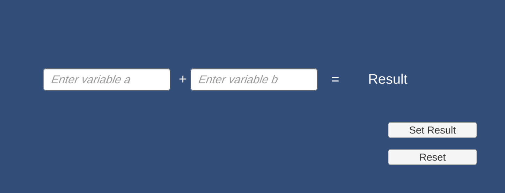

# home-simpleAddNumbers2D-sloos
 
 ### Project description: 
Simple Calculator. 2 Input-fields to type in numbers. 2 buttons (one "result"- and one "reset"- button)

### Development platform: 
Unity version 2019.1.14f1
Visual Studio Community 2017
Mac Os Mojave Version 10.14.6

### Target platform: 
WebGL

### Visuals: 

### Necessary setup/execution steps: 
Installation process, e.g. step by step instructions that I can run the project after cloning it

### Third party material: 
help from THomas Junger

### Project state: 
100% done

### Lessons Learned: 
what a magica string is :)

Copyright by sloos 